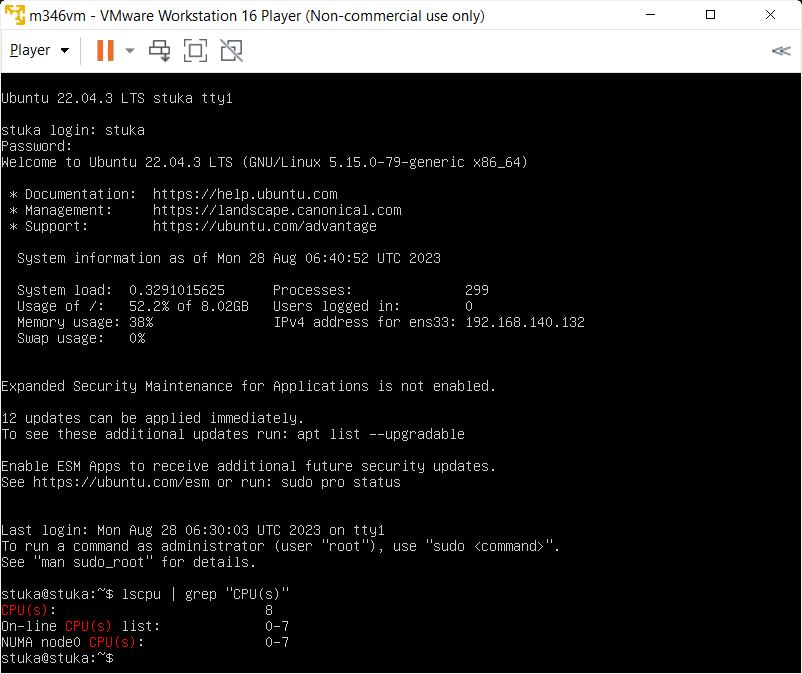
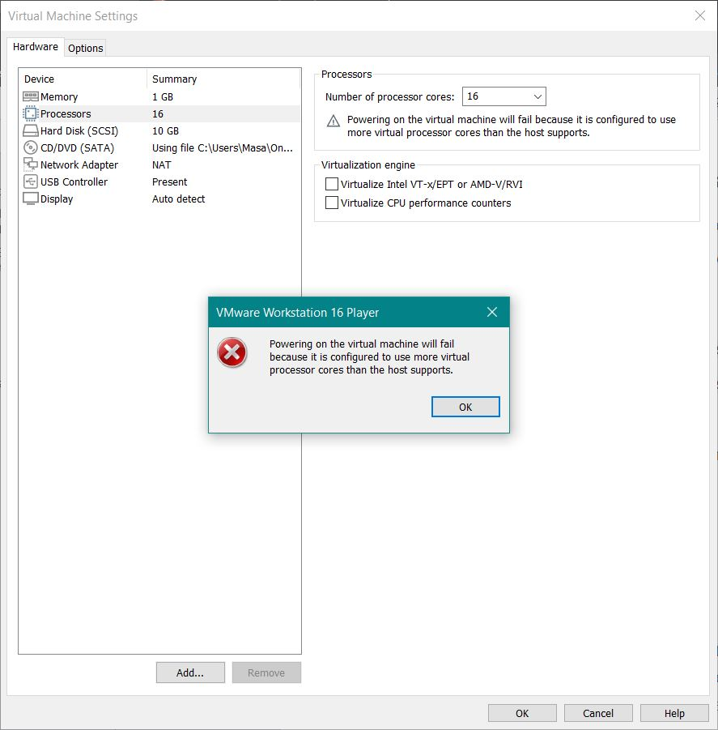
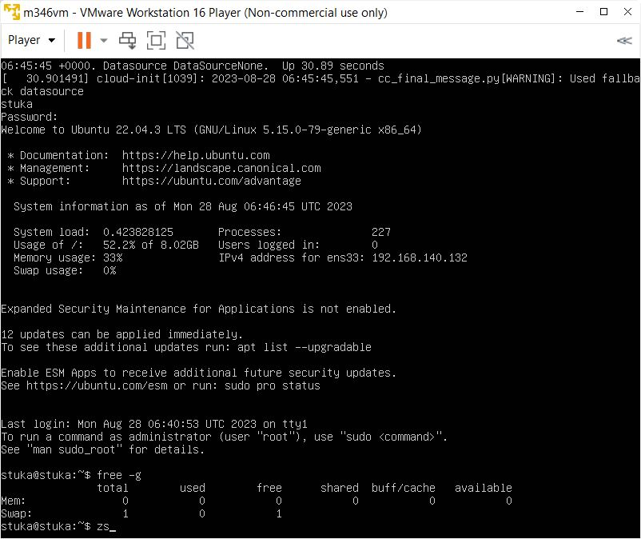
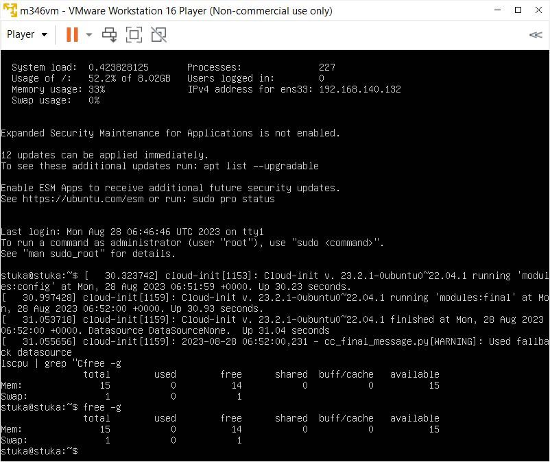
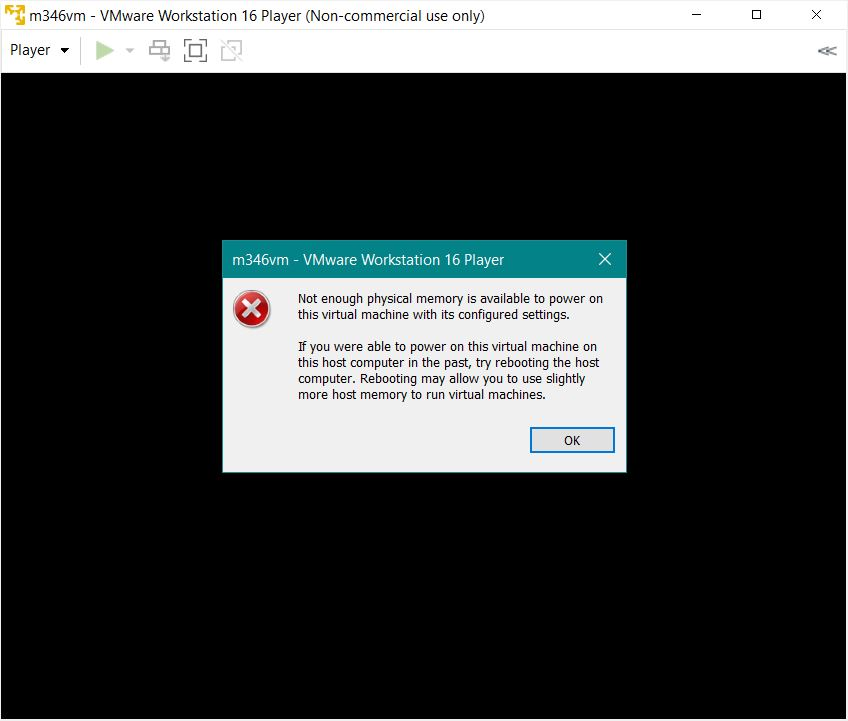

# Less cores than host device

# Same amount of cores as host device

# More cores than host device

# Less RAM than host device

# Same amount of RAM as host device

# More ram than host device

