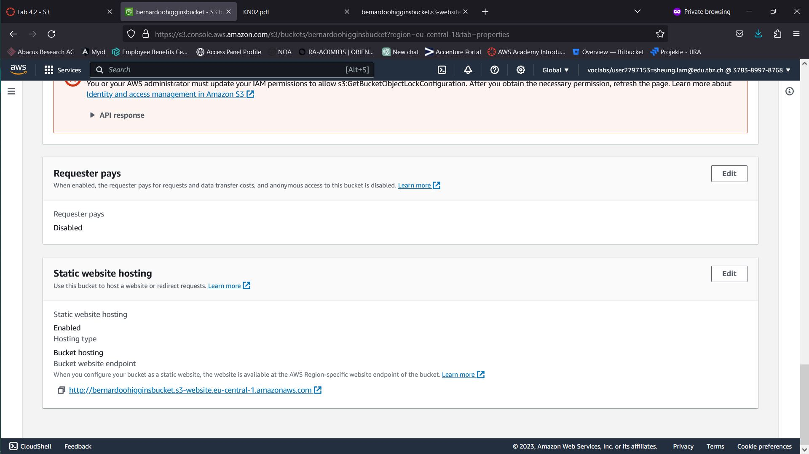
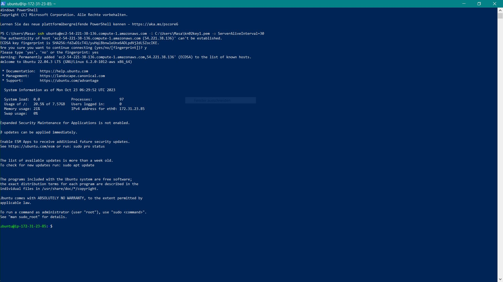
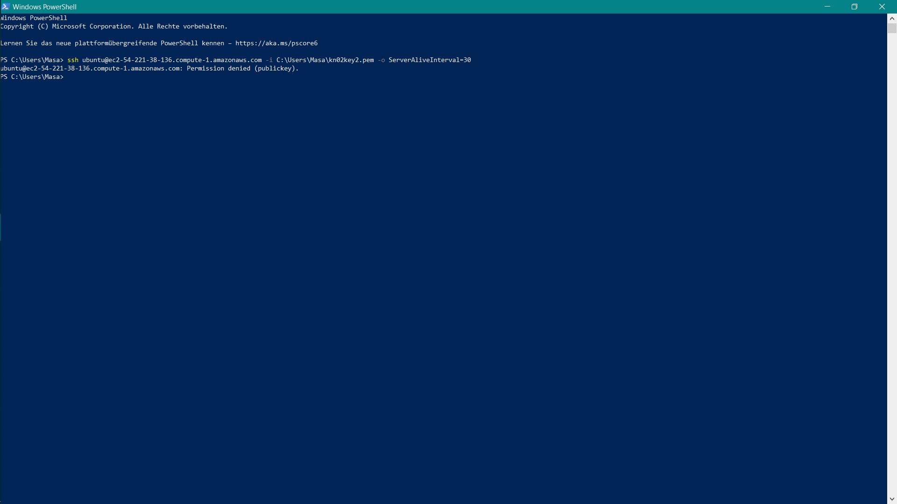
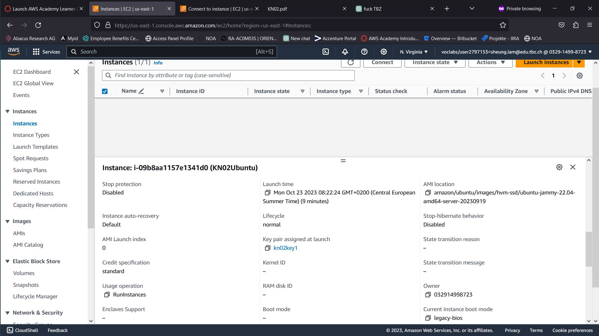
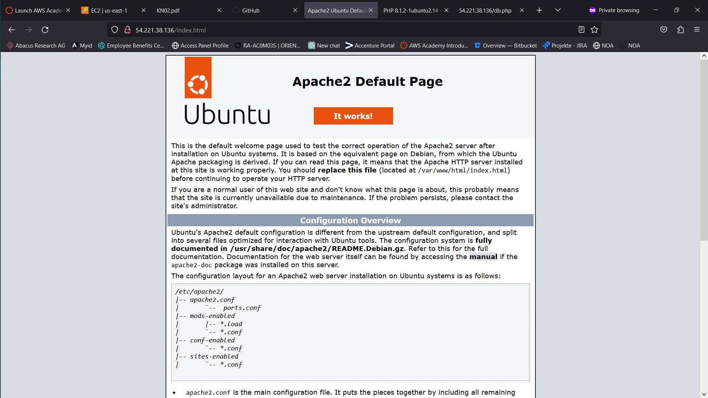
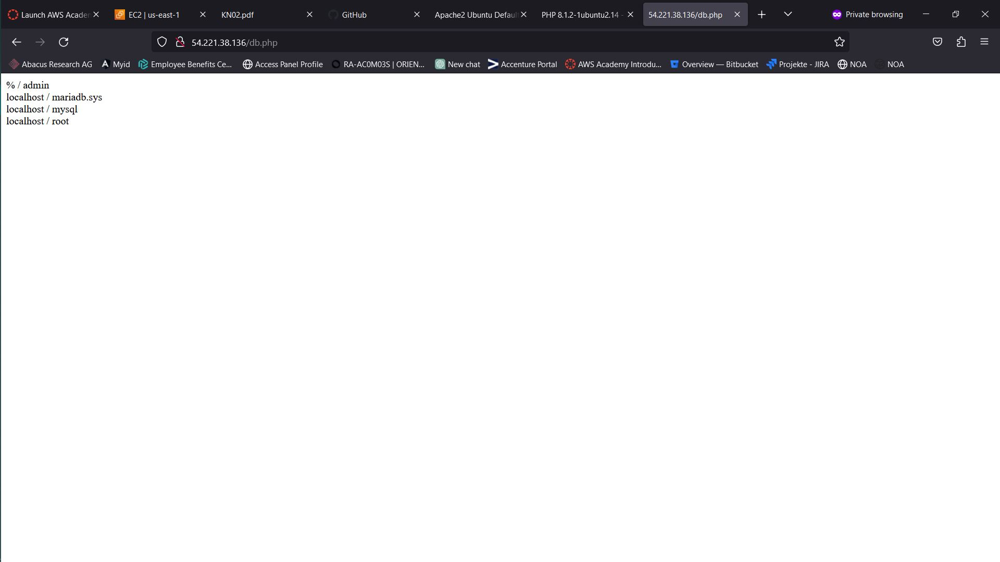
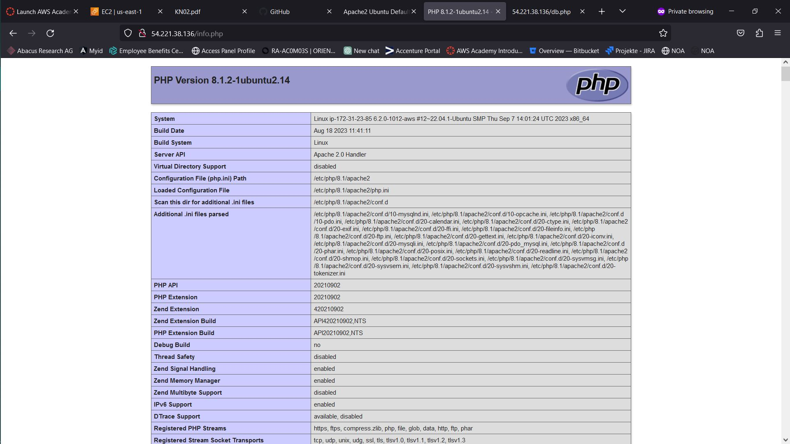

# KN02

## a) lab 4.1

- HTML-Seite

- Liste der EC2-Instanzen

- Details der Web Server-Instanz

- Security-Group: Liste der Inbound-Regeln

## a) lab 4.2

- Liste der Buckets

  
- HTML-Seite, inkl. URL

  
- Liste der Dateien im Bucket

  
- Eigenschaften von "Static website hosting"

## Zugriff mit SSH-Key

- Screenshot mit dem ssh-Befehl und des Resultats unter Verwendung des ersten Schlüssels

- Screenshot mit dem ssh-Befehl und des Resultats unter Verwendung des zweiten Schlüssels

- Screenshot der Instanz-Detail (oder Liste), so dass der verwendete Schlüssel sichtbar ist

##  Installation von Web- und Datenbankserver

- Apache Seite

- Maria DB Seite

- Php Seite

 
