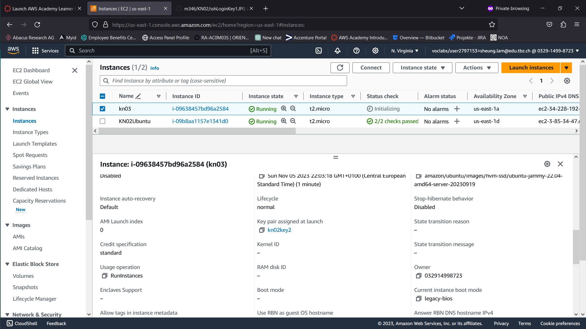
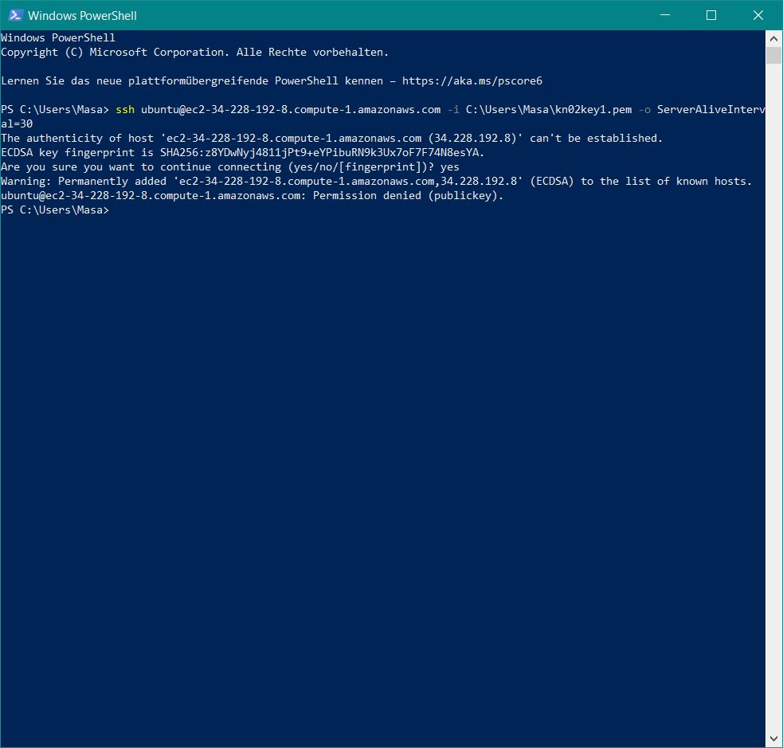
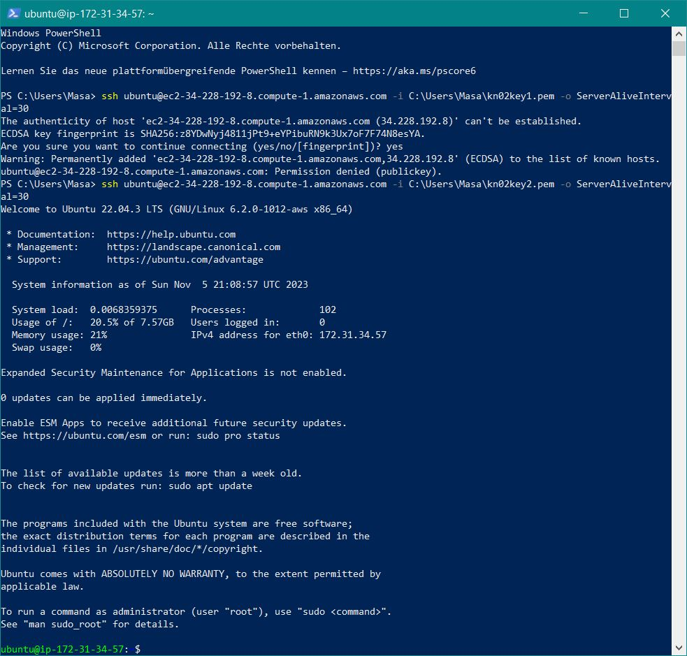
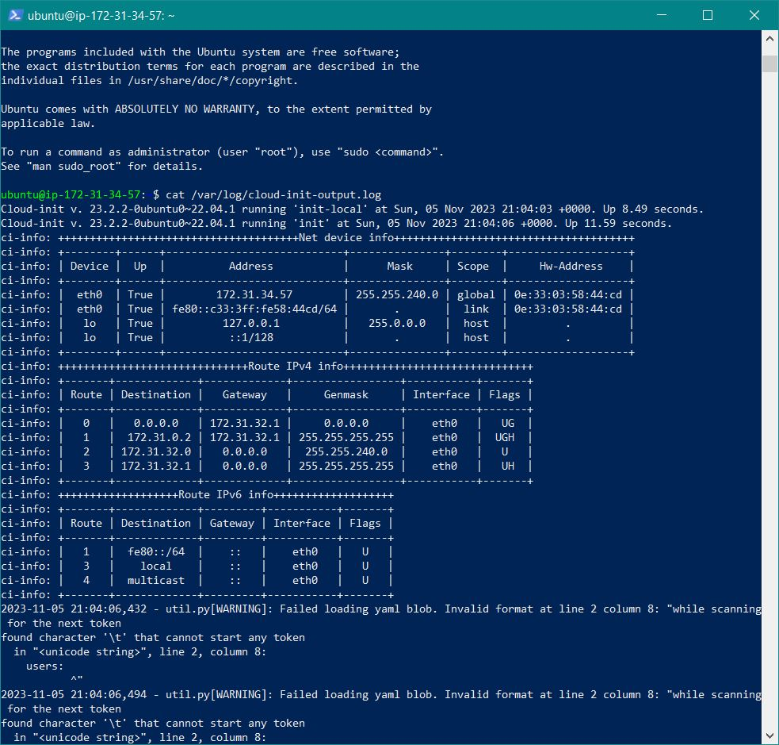
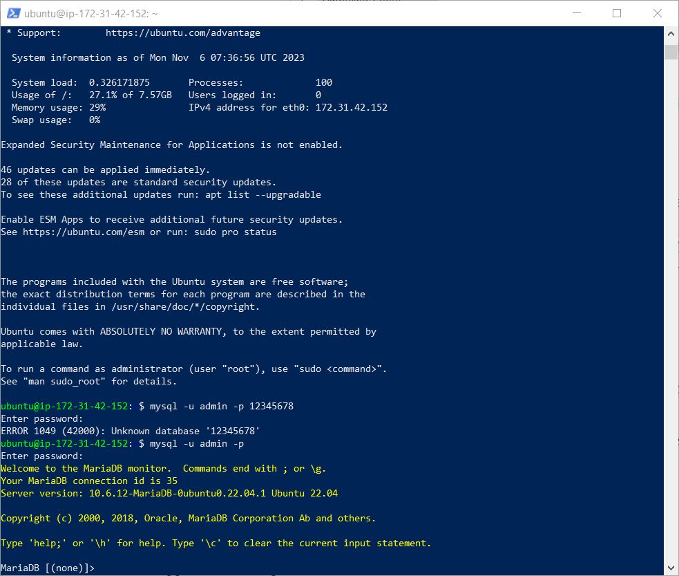
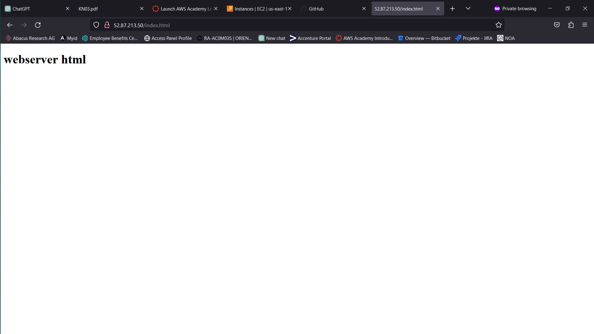

A)

```plaintext

#cloud-config
users: 			# Benutzerinfo
  - name: ubuntu 		# Benutzername
    sudo: ALL=(ALL) NOPASSWD:ALL # sudo-Regeln für diesen Benutzer
    groups: users, admin 	# Benutzergruppen
    home: /home/ubuntu 	# Homeverzeichnis
    shell: /bin/bash 		# Standardshell
    ssh_authorized_keys:	# Oeffentliche Schluessel, damit man ueber SSH einloggen kann
      - ssh-rsa MIIEpAIBAAKCAQEAnuYQSlq5z5Rx4LY+FY3+0Shw8tZTW3KxfiiZ38MswzGBsH/q
3/AnGpReO785q8ThUjVyBSM/5DFzlPeAsDwoAd8doacKg1GmKPyMQJcY/oQTpPEy
FlBWT9X/u/TWUWEK3DmCQ3eR6PVbMJeA4noYhCc1giPXO9lg3p5VogQCQLttHcdA
mDm0e7dY1x9YWs2YhFu5YYR+0o7gn+vUK97kvC3ZFapHIO/dca5BmWTwg2nZuTGL
7DhUSZiq6/z2RTAc/+loKAGTBDI/lbe5iAL30Y2isYs4gRNdZ9JW5XAoO5LOFnPu
Yw6ly65P7kHOKwwIrZK0CCrhbca6M9pp+W+NewIDAQABAoIBACFzo7hTk0ydHsBE
/ZsCEsQrtGObNV9KLQ23NHXEHBdXw8rJk0Pjxge1doUzg8uiniD1eXSVcCz1MDUL
Sf9QGsgSFaXjibYNqWJ1kH1EkhF68rvFv1qtPQ5/qeAC8l+dg3DLdp4HfSNDDBiV
vJ9xPtoLextTuksyP09+m96I44SG248+UU3s3egxGXgzvhyvWbldU2Qg2OK0wK3w
ewdQEmR7a0X7ym1EtuFMelHRe3NEOf0r5ukLYgiWnyC+/l3wA0cTeeaHUxXnj/m0
LdLKgQoJdy2mxBedBuAl1dcWqkSlZKPOpheLMe08jYIxyrdtBKay8EpDQ5Rsnl7N
jlP9Z7kCgYEA2X58+RAS3NJ7i8UudMT2R0yq7FmYyK47MVbQfVHy4G7Tt/yVF0nF
Nqkvzjpyk6kMm4fFpvKSOl9fAaVXphzsRMaai7qLV62kjSIjgEKfDeGxG7jiu81f
mooF0Hz6kRHILTDFfgYbHLHxY+bV7NVxlm8oZXaNAunxYAGOhVYUnW8CgYEAuwfZ
NxG7adpZEXUTOmBlEWm7XPOnj0JpLrmxsGZ9rVgiyPSVmMQ89liCZDAGghjYFtl+
E5qy3Y6NdbSZV9vZd1kKj7jdPIV3aj/+cJ7WMhrcq/LjfvonA6gIWIYGuBxYeW1w
80gqJutXmWQKiyl8KdkwKBBfXHOv5OKt6lyEorUCgYB99Y5lJBT4hIH+oZTVFZjY
FCPNO9qLJrSrT27xlTtHFYhSPtsNoLCxhmxkUF84+yeND6W9mTBs0/0O0/YeAxQm
hKrOj5vRjIQHJKVQy8SX4oSS3JGbWEatFpBlfWwUBitbWKqX4Otkw/1b8T0lqzvc
dsX7dRwXeutKwbwLpp3LywKBgQCyYu3+5F7Iu4WwbOYGC+LaFOqr4YmzzjfcZSjh
gx/jseibmw0EREeQ/yJ+xH+wnlmckZz6vdZUE59A4RxQ/FQSzU6RflUlYHdhU+Av
MpBCAfTv3B64AYgsqJwtMsg92mtYhdXxdKcfr+BBYXXc/Zh7obeYvuT1nTHrMXmH
yu6G8QKBgQCUs8WF5YLClbSTOAf2HmmuVMnkWdG7Ou6rqbC8lBp3dPSYSIc5Y04O
a3buqyvv3uxuLuwOT6RwR7tpGL6pwzesAen+xIqQv2YtF/Tb8LY0PkWEN+CwtIHg
lbERzLIzAffbr59C2xq5TTSsq0BWjoLjhePVrbJF+2b7MtT6Nk1BSw== aws-key       
ssh_pwauth: false		# Einloggen mit Passwort nicht erlaubt
disable_root: false 		# Rootzugriff nicht deaktiviert
package_update: true		# Pakete werden aktualisiert
packages:			# curl und wget Pakete werden installiert
  - curl 
  - wget 

B)

#cloud-config
users: 			# Benutzerinfo
  - name: ubuntu 		# Benutzername
    sudo: ALL=(ALL) NOPASSWD:ALL # sudo-Regeln für diesen Benutzer
    groups: users, admin 	# Benutzergruppen
    home: /home/ubuntu 	# Homeverzeichnis
    shell: /bin/bash 		# Standardshell
    ssh_authorized_keys:	# Oeffentliche Schluessel, damit man ueber SSH einloggen kann
      - ssh-rsa MIIEpAIBAAKCAQEAnuYQSlq5z5Rx4LY+FY3+0Shw8tZTW3KxfiiZ38MswzGBsH/q
3/AnGpReO785q8ThUjVyBSM/5DFzlPeAsDwoAd8doacKg1GmKPyMQJcY/oQTpPEy
FlBWT9X/u/TWUWEK3DmCQ3eR6PVbMJeA4noYhCc1giPXO9lg3p5VogQCQLttHcdA
mDm0e7dY1x9YWs2YhFu5YYR+0o7gn+vUK97kvC3ZFapHIO/dca5BmWTwg2nZuTGL
7DhUSZiq6/z2RTAc/+loKAGTBDI/lbe5iAL30Y2isYs4gRNdZ9JW5XAoO5LOFnPu
Yw6ly65P7kHOKwwIrZK0CCrhbca6M9pp+W+NewIDAQABAoIBACFzo7hTk0ydHsBE
/ZsCEsQrtGObNV9KLQ23NHXEHBdXw8rJk0Pjxge1doUzg8uiniD1eXSVcCz1MDUL
Sf9QGsgSFaXjibYNqWJ1kH1EkhF68rvFv1qtPQ5/qeAC8l+dg3DLdp4HfSNDDBiV
vJ9xPtoLextTuksyP09+m96I44SG248+UU3s3egxGXgzvhyvWbldU2Qg2OK0wK3w
ewdQEmR7a0X7ym1EtuFMelHRe3NEOf0r5ukLYgiWnyC+/l3wA0cTeeaHUxXnj/m0
LdLKgQoJdy2mxBedBuAl1dcWqkSlZKPOpheLMe08jYIxyrdtBKay8EpDQ5Rsnl7N
jlP9Z7kCgYEA2X58+RAS3NJ7i8UudMT2R0yq7FmYyK47MVbQfVHy4G7Tt/yVF0nF
Nqkvzjpyk6kMm4fFpvKSOl9fAaVXphzsRMaai7qLV62kjSIjgEKfDeGxG7jiu81f
mooF0Hz6kRHILTDFfgYbHLHxY+bV7NVxlm8oZXaNAunxYAGOhVYUnW8CgYEAuwfZ
NxG7adpZEXUTOmBlEWm7XPOnj0JpLrmxsGZ9rVgiyPSVmMQ89liCZDAGghjYFtl+
E5qy3Y6NdbSZV9vZd1kKj7jdPIV3aj/+cJ7WMhrcq/LjfvonA6gIWIYGuBxYeW1w
80gqJutXmWQKiyl8KdkwKBBfXHOv5OKt6lyEorUCgYB99Y5lJBT4hIH+oZTVFZjY
FCPNO9qLJrSrT27xlTtHFYhSPtsNoLCxhmxkUF84+yeND6W9mTBs0/0O0/YeAxQm
hKrOj5vRjIQHJKVQy8SX4oSS3JGbWEatFpBlfWwUBitbWKqX4Otkw/1b8T0lqzvc
dsX7dRwXeutKwbwLpp3LywKBgQCyYu3+5F7Iu4WwbOYGC+LaFOqr4YmzzjfcZSjh
gx/jseibmw0EREeQ/yJ+xH+wnlmckZz6vdZUE59A4RxQ/FQSzU6RflUlYHdhU+Av
MpBCAfTv3B64AYgsqJwtMsg92mtYhdXxdKcfr+BBYXXc/Zh7obeYvuT1nTHrMXmH
yu6G8QKBgQCUs8WF5YLClbSTOAf2HmmuVMnkWdG7Ou6rqbC8lBp3dPSYSIc5Y04O
a3buqyvv3uxuLuwOT6RwR7tpGL6pwzesAen+xIqQv2YtF/Tb8LY0PkWEN+CwtIHg
lbERzLIzAffbr59C2xq5TTSsq0BWjoLjhePVrbJF+2b7MtT6Nk1BSw== aws-key       
ssh_pwauth: false		# Einloggen mit Passwort nicht erlaubt
disable_root: false 		# Rootzugriff nicht deaktiviert
package_update: true		# Pakete werden aktualisiert
packages:			# curl und wget Pakete werden installiert
  - curl 
  - wget 









C)

#cloud-config
users: 			# Benutzerinfo
  - name: ubuntu 		# Benutzername
    sudo: ALL=(ALL) NOPASSWD:ALL # sudo-Regeln für diesen Benutzer
    groups: users, admin 	# Benutzergruppen
    home: /home/ubuntu 	# Homeverzeichnis
    shell: /bin/bash 		# Standardshell
    ssh_authorized_keys:	# Oeffentliche Schluessel, damit man ueber SSH einloggen kann
      - ssh-rsa MIIEpAIBAAKCAQEAnuYQSlq5z5Rx4LY+FY3+0Shw8tZTW3KxfiiZ38MswzGBsH/q
3/AnGpReO785q8ThUjVyBSM/5DFzlPeAsDwoAd8doacKg1GmKPyMQJcY/oQTpPEy
FlBWT9X/u/TWUWEK3DmCQ3eR6PVbMJeA4noYhCc1giPXO9lg3p5VogQCQLttHcdA
mDm0e7dY1x9YWs2YhFu5YYR+0o7gn+vUK97kvC3ZFapHIO/dca5BmWTwg2nZuTGL
7DhUSZiq6/z2RTAc/+loKAGTBDI/lbe5iAL30Y2isYs4gRNdZ9JW5XAoO5LOFnPu
Yw6ly65P7kHOKwwIrZK0CCrhbca6M9pp+W+NewIDAQABAoIBACFzo7hTk0ydHsBE
/ZsCEsQrtGObNV9KLQ23NHXEHBdXw8rJk0Pjxge1doUzg8uiniD1eXSVcCz1MDUL
Sf9QGsgSFaXjibYNqWJ1kH1EkhF68rvFv1qtPQ5/qeAC8l+dg3DLdp4HfSNDDBiV
vJ9xPtoLextTuksyP09+m96I44SG248+UU3s3egxGXgzvhyvWbldU2Qg2OK0wK3w
ewdQEmR7a0X7ym1EtuFMelHRe3NEOf0r5ukLYgiWnyC+/l3wA0cTeeaHUxXnj/m0
LdLKgQoJdy2mxBedBuAl1dcWqkSlZKPOpheLMe08jYIxyrdtBKay8EpDQ5Rsnl7N
jlP9Z7kCgYEA2X58+RAS3NJ7i8UudMT2R0yq7FmYyK47MVbQfVHy4G7Tt/yVF0nF
Nqkvzjpyk6kMm4fFpvKSOl9fAaVXphzsRMaai7qLV62kjSIjgEKfDeGxG7jiu81f
mooF0Hz6kRHILTDFfgYbHLHxY+bV7NVxlm8oZXaNAunxYAGOhVYUnW8CgYEAuwfZ
NxG7adpZEXUTOmBlEWm7XPOnj0JpLrmxsGZ9rVgiyPSVmMQ89liCZDAGghjYFtl+
E5qy3Y6NdbSZV9vZd1kKj7jdPIV3aj/+cJ7WMhrcq/LjfvonA6gIWIYGuBxYeW1w
80gqJutXmWQKiyl8KdkwKBBfXHOv5OKt6lyEorUCgYB99Y5lJBT4hIH+oZTVFZjY
FCPNO9qLJrSrT27xlTtHFYhSPtsNoLCxhmxkUF84+yeND6W9mTBs0/0O0/YeAxQm
hKrOj5vRjIQHJKVQy8SX4oSS3JGbWEatFpBlfWwUBitbWKqX4Otkw/1b8T0lqzvc
dsX7dRwXeutKwbwLpp3LywKBgQCyYu3+5F7Iu4WwbOYGC+LaFOqr4YmzzjfcZSjh
gx/jseibmw0EREeQ/yJ+xH+wnlmckZz6vdZUE59A4RxQ/FQSzU6RflUlYHdhU+Av
MpBCAfTv3B64AYgsqJwtMsg92mtYhdXxdKcfr+BBYXXc/Zh7obeYvuT1nTHrMXmH
yu6G8QKBgQCUs8WF5YLClbSTOAf2HmmuVMnkWdG7Ou6rqbC8lBp3dPSYSIc5Y04O
a3buqyvv3uxuLuwOT6RwR7tpGL6pwzesAen+xIqQv2YtF/Tb8LY0PkWEN+CwtIHg
lbERzLIzAffbr59C2xq5TTSsq0BWjoLjhePVrbJF+2b7MtT6Nk1BSw== aws-key
      - ssh-rsa AAAAB3NzaC1yc2EAAAADAQABAAABAQC0WGP1EZykEtv5YGC9nMiPFW3U3DmZNzKF
O5nEu6uozEHh4jLZzPNHSrfFTuQ2GnRDSt+XbOtTLdcj26+iPNiFoFha42aCIzYj
t6V8Z+SQ9pzF4jPPzxwXfDdkEWylgoNnZ+4MG1lNFqa8aO7F62tX0Yj5khjC0Bs7
Mb2cHLx1XZaxJV6qSaulDuBbLYe8QUZXkMc7wmob3PM0kflfolR3LE7LResIHWa4
j4FL6r5cQmFlDU2BDPpKMFMGUfRSFiUtaWBNXFOWHQBC2+uKmuMPYP4vJC9sBgqM
vPN/X2KyemqdMvdKXnCfrzadHuSSJYEzD64Cve5Zl9yVvY4AqyBD
 aws-key
ssh_pwauth: false		# Einloggen mit Passwort nicht erlaubt
disable_root: false 		# Rootzugriff nicht deaktiviert
package_update: true		# Pakete werden aktualisiert
packages:			# curl und wget Pakete werden installiert
  - curl 
  - wget 


D)



#cloud-config
packages:
  - mariadb-server

write_files:
  - content: |
      [mysqld]
      bind-address = 0.0.0.0
    path: /etc/mysql/mariadb.conf.d/50-server.cnf

runcmd:
  - sudo systemctl restart mariadb
  - sudo mysql -e "CREATE DATABASE my_database;"
  - sudo mysql -e "CREATE USER 'admin'@'%' IDENTIFIED BY '12345678';"
  - sudo mysql -e "GRANT ALL PRIVILEGES ON *.* TO 'admin'@'%' WITH GRANT OPTION;"





#cloud-config
packages:
  - apache2
  - php
  - libapache2-mod-php
  - php-mysql

write_files:
  - content: |
      <!DOCTYPE html>
      <html>
      <body>
        <h1>webserver html</h1>
      </body>
      </html>
    path: /var/www/html/index.html

runcmd:
  - sudo systemctl restart apache2


