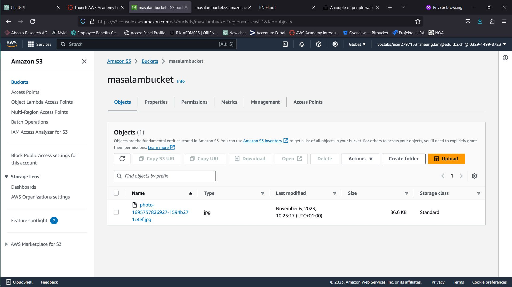
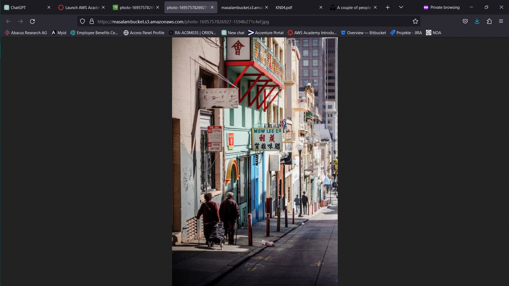
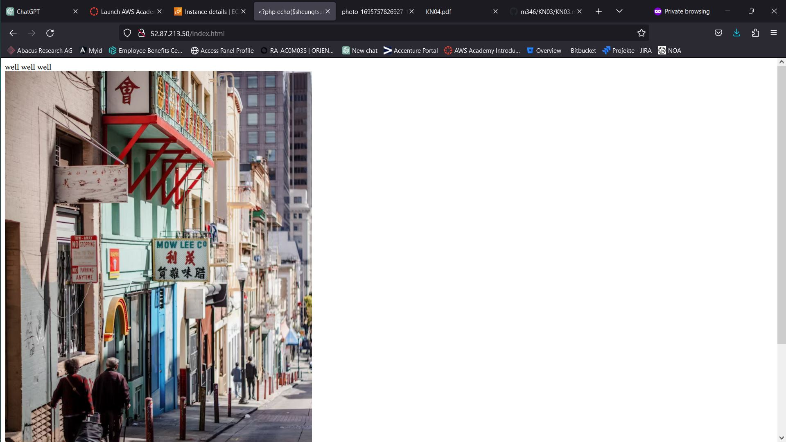
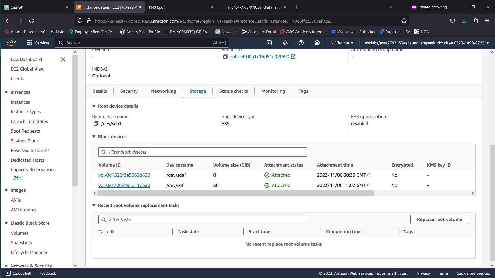

A)





B)

```

#cloud-config
packages:
  - apache2
  - php
  - libapache2-mod-php

write_files:
  - content: |
      <?php
$ihrname = "Sheung Tsung Lam";
?>
<html>
<head>
<title><?php echo($sheungtsunglam); ?></title>
</head>
<body>
well well well
<br />
 
<br />
<p>no references</p>
</body>
</html>

    path: /var/www/html/index.html

runcmd:
  - sudo systemctl restart apache2

```



C)



D)

| -------- | typ | persistenz |
| -------- | -------- | -------- |
| EBS Root | hot | ja |
| EBS Zusätzliches Volumen | hot  | ja |
| S3 | hot | ja |


