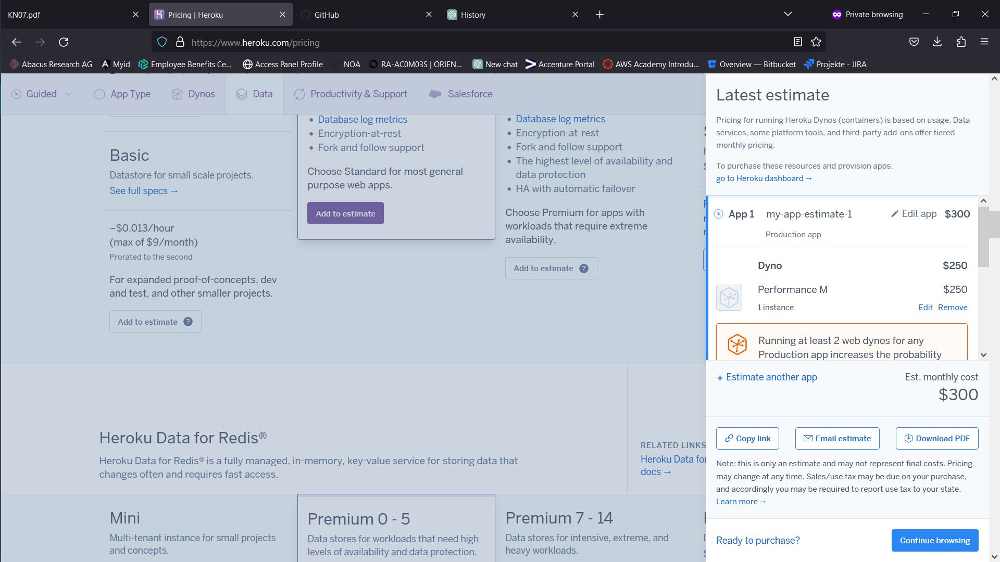
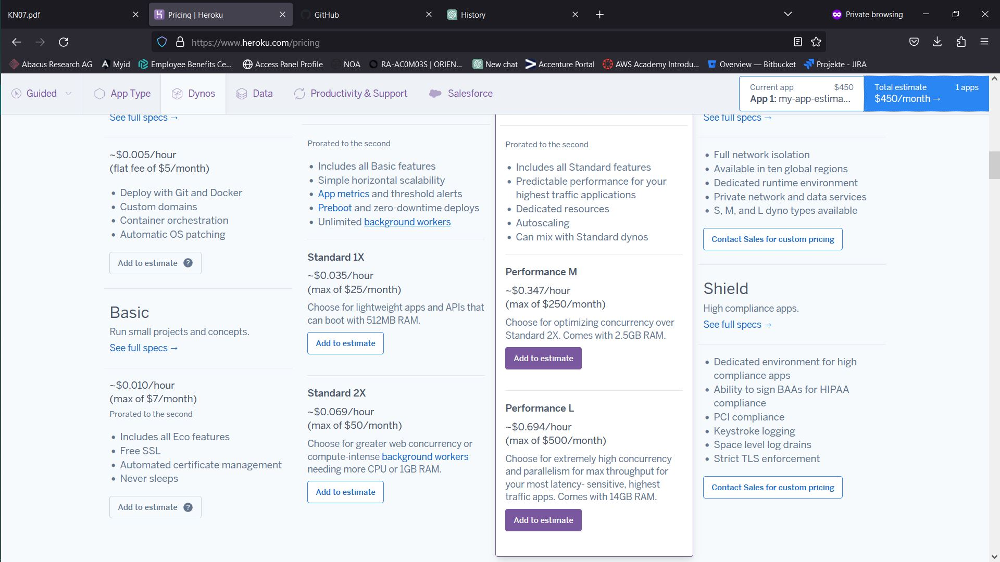
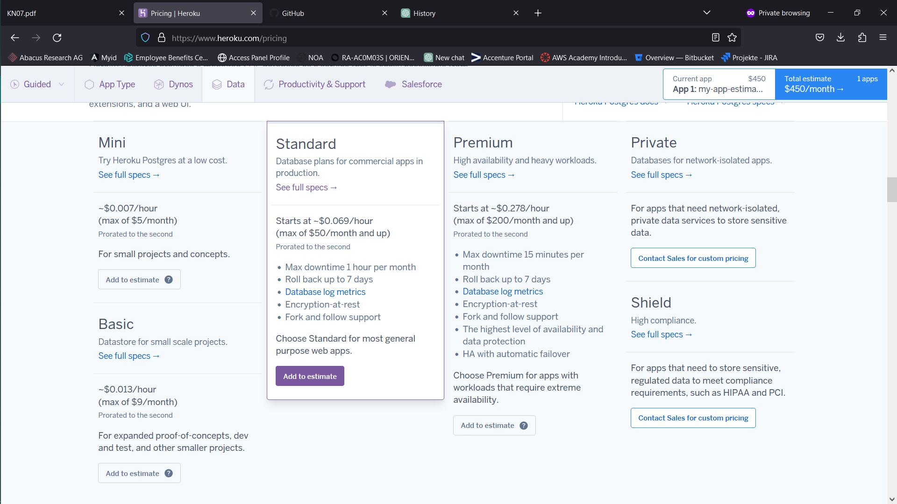
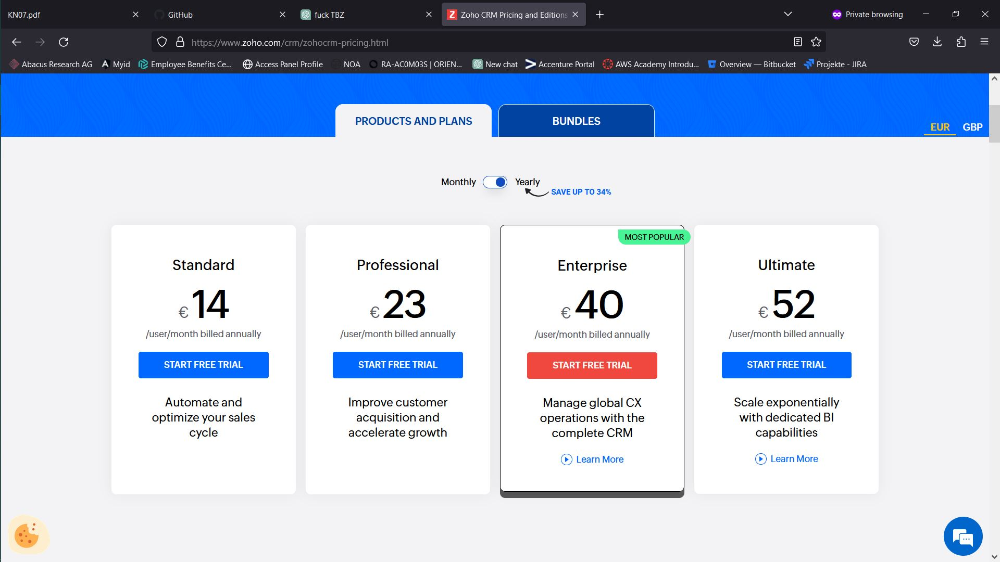
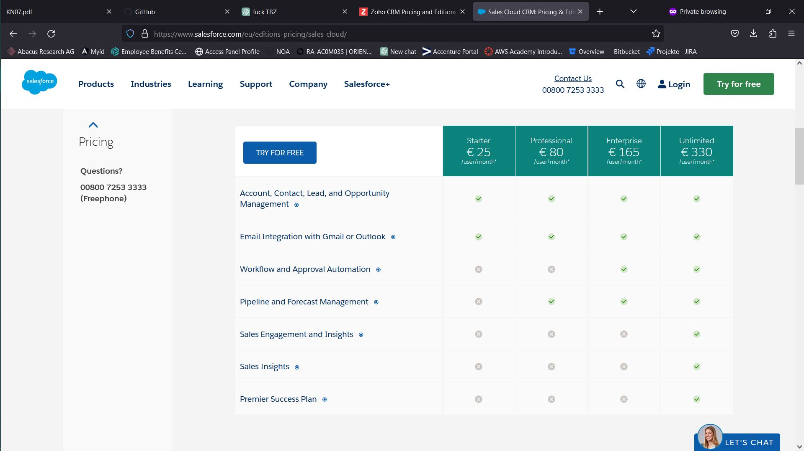

# KN07

# Rehosting

## AWS

Nach meiner Einschätzung kosted das Rehosting monatlich 1865 US-Dollar. Es gabt kein Angebot, das genau den Anforderungen zutrifft. In dieser Situation wären mir zu starke Server lieber als zu schwache. Deshalb war ich Grosszügig mit den Spezifikationen. Der Web-Server bietet 2 vCPUs, 4 GB RAM und 30 GB SSD-Speicher. Der DB-Server bietet 2 vCPUs, 8 GB RAM und 120 GB SSD-Speicher.

Hier ist die Einschätzung als CSV.

## Azure

Bei Azure war die Skalierbarkeit der Server deutlich besser, da Azure mehr anpassbare Optionen bietet. Mit knapp 489 US-Dollar im Monat bekommt man Server, die zwar schwächer sind als die bei AWS für 1865 US-Dollar, aber trotzdem den angegebenen Anforderungen übertreffen. Der Web-Server bietet 2 vCPUs, 8 GB RAM und 40 GB SSD-Speicher. Der DB-Server bietet 4 vCPUs, 16 GB RAM und 160 GB SSD-Speicher. 

## Zusammenfassung

Für die umfangreiche Kombinationsmöglichkeiten der Dienstleistungen würde ich mich für Microsoft Azure entscheiden. Auch das Preis-Leistungs-Verhältnis spielt eine Grosse Rolle.

# Replatforming

Nach meiner Einschätzung wird das Replatforming bei Heroku 300 US-Dollar im Monat kosten.

Für den Webserver entschied ich mich für den Paket "Performance M", da es eine ausgewogene Mischung aus Ressourcen und Leistung bietet, die den Anforderungen des Webservers entspricht. Für 250 US-Dollar ist der Preis auch sehr gerechtfertigt.

Für den DB-Server entschied ich mich für "Standard" anstatt "Premium", weil "Premium" nicht viel mehr bietet aber 4x den Preis ist. 

# Repurchasing

Bei Zoho oder Sales Cloud CRM sind die Angaben der Angebote zu unklar. Mein Vorgehen hier wäre, mit den günstigsten Angebote anzufangen und bei Bedarf nachzurüsten. 
Die Preise wären also:
Zoho: 224 Euro/Monat
Sales Cloud CRM: 400 Euro/Monat

# Interpretation der Resultate

Die Angebote unterscheiden sich sehr stark. Das teuerste Angebot ist mehr als 8x der Preis des günstigsten. Natürlich bietet AWS viel mehr für 1865 US-Dollar als Zoho für 224 Euro. Bei AWS erhält man dafür leistungsstarke Server und viele Anpassungsoptionen. Dies erklärt den signifikanten Preisunterschied zwischen AWS und Zoho.

Azure bietet eine kostengünstigere Alternative zu AWS und erfüllt die spezifizierten Anforderungen, da Azure noch flexiblere ServerStrukturen hat. Obwohl die Server bei Azure weniger leistungsstark sind als bei AWS, reichen sie aus, um die Anforderungen zu erfüllen.

Ich persönlich bevorzuge Heroku. Heroku ist weniger Kompliziert als AWS oder Azure, gleichzeitig auch anpassungsfähiger als Zoho oder Sales Cloud CRM. Für nur 300 US-Dollar kann man sich hier nicht beschweren.
