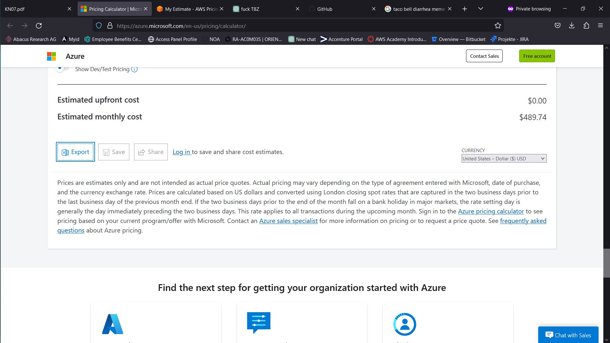
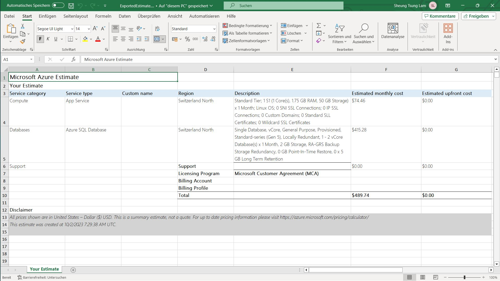

# KN07

# Rehosting

## AWS

Nach meiner Einschätzung kosted das Rehosting monatlich 1865 US-Dollar. Es gabt kein Angebot, das genau den Anforderungen zutrifft. In dieser Situation wären mir zu starke Server lieber als zu schwache. Deshalb war ich Grosszügig mit den Spezifikationen.

Hier ist die Einschätzung als CSV.

## Azure

Bei Azure war die Skalierbarkeit der Server deutlich besser, da Azure mehr anpassbare Optionen bietet. Mit knapp 489 US-Dollar im Monat bekommt man Server, die zwar schwächer sind als die bei AWS für 1865 US-Dollar, aber trotzdem den angegebenen Anforderungen übertreffen.

