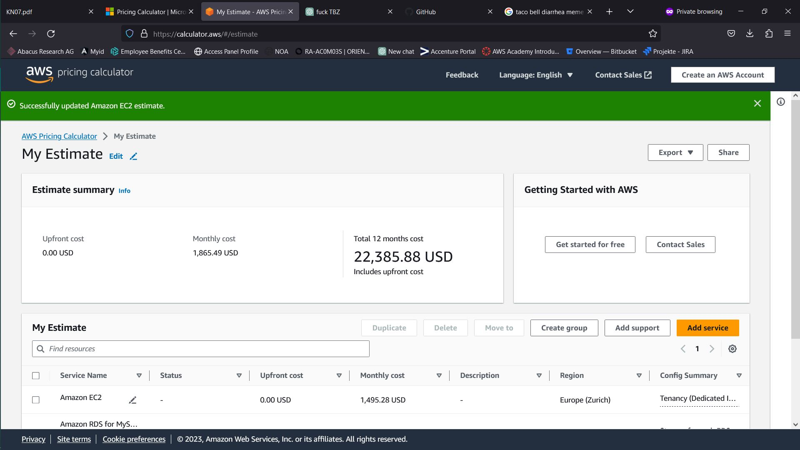

# KN07

# Rehosting

## AWS

Nach meiner Einschätzung kosted das Rehosting monatlich 1865 US-Dollar. Es gabt kein Angebot, das genau den Anforderungen zutrifft. In dieser Situation wären mir zu starke Server lieber als zu schwache. Deshalb war ich Grosszügig mit den Spezifikationen. Der Web-Server bietet 2 vCPUs, 4 GB RAM und 30 GB SSD-Speicher. Der DB-Server bietet 2 vCPUs, 8 GB RAM und 120 GB SSD-Speicher.

Hier ist die Einschätzung als CSV.

## Azure

Bei Azure war die Skalierbarkeit der Server deutlich besser, da Azure mehr anpassbare Optionen bietet. Mit knapp 489 US-Dollar im Monat bekommt man Server, die zwar schwächer sind als die bei AWS für 1865 US-Dollar, aber trotzdem den angegebenen Anforderungen übertreffen. Der Web-Server bietet 2 vCPUs, 8 GB RAM und 40 GB SSD-Speicher. Der DB-Server bietet 4 vCPUs, 16 GB RAM und 160 GB SSD-Speicher. 

## Zusammenfassung

Für die umfangreiche Kombinationsmöglichkeiten der Dienstleistungen würde ich mich für Microsoft Azure entscheiden. Auch das Preis-Leistungs-Verhältnis spielt eine Grosse Rolle.

# Replatforming

